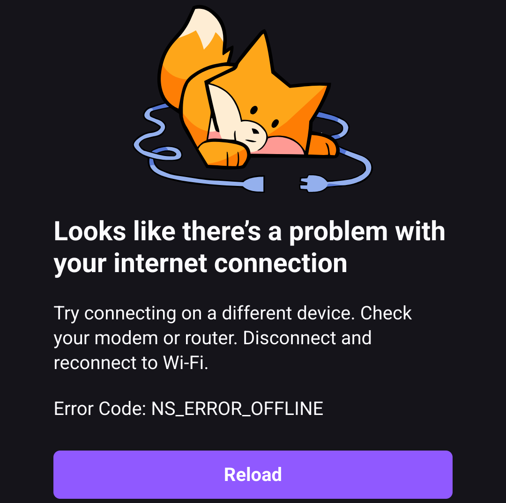

You type `bbc.com` into Firefox and hit Enter. Instantly, a page loads, but it's not the famous website to check the latest news you were expecting. Instead, you see Firefox's mascot, a cartoon fox, looking dejected as he watches a disconnected cable. The message reads: "Looks like there's a problem with your internet connection" with the code `NS_ERROR_OFFLINE`. 
This recently happened to a friend of mine, Alex, while we were talking. Suddenly, he asked me:

"Hey Dude, any chance you know where this error comes from and who does emit it?"

Both of us knew it was clearly a decision made by the browser team, and the choice of mascot was a strong hint. But the topic was too interesting to leave without further exploration, so here we are. I took some time to learn something new, investigate the `mozilla-central` repo, and bring some clarity, which I hope you enjoy reading.

Let's cut to the chase.

### How did Firefox know we are offline so fast?

Let's follow the trail.

The answer lies in a quiet conversation between the browser and the operating system (OS). The moment we press Enter, Firefox asks our OS a question: "Are we online?" The OS, whether Windows, macOS, or Linux, has already been running background checks.

On macOS, the OS checks if there's a valid route to the wider internet (like a default gateway). Linux relies on tools like NetworkManager to confirm DHCP and DNS health. If any of these fail, the OS declares the system offline and Firefox listens.

This is why the error page appears instantly. Firefox isn't fetching it from the web. The page is stored locally in a file called `omni.ja`, a compressed archive containing browser resources, part of Firefox's installation. The URL `about:neterror?e=offline` is a special internal address, like a secret door Firefox uses to show errors without hitting the network. You wanna check? Open the Developer Tools, switch to the Network tab, and you'll see no requests. The fox, the text, the CSS: everything is sourced locally.

To understand why this is efficient, let's map it to the OSI model. Normally, a web request passes through all 7 layers: from physical (cables/Wi-Fi) up to application (HTTP). But when the OS says offline, Firefox simply shortcuts the process:

* **Layer 1/2 (Physical/Data Link):** Your Wi-Fi is disconnected. No frames are sent.
* **Layer 3 (Network):** The OS kernel sees no valid route to an external IP.
* **Layer 7 (Application):** Firefox serves a local error page.

Layers 4–6 (Transport, Session, Presentation) are skipped entirely. No TCP handshake. No TLS encryption. No HTTP. Firefox trusts the OS's verdict and prioritizes speed over redundancy.

At this point, I can hear Alex's voice saying: "Waitaminute, prove me that!"

So, let's go folks! Let's dive a bit deeper into the code.

Firefox checks the OS's network status via `nsINetworkLinkService`, which directly interfaces with OS APIs (e.g., NetworkManager on Linux, Reachability on macOS). This service interface exposes attributes like `isLinkUp` and `linkStatusKnown`. Under normal conditions (for example, after a DHCP process completes) `isLinkUp` is `true`.

When the network is interrupted, the system's network interface signals a change. The network link service then updates its internal state so that:

* `isLinkUp` becomes `false`
* `linkStatusKnown` remains `true`.

The browser's internal code "watches" for changes to these attributes. When a change indicates the link is down, it sends a notification using an observer service with the topic `network:link-status-changed` and data equal to `NS_NETWORK_LINK_DATA_DOWN`. This value is passed along with the notification.

Various parts of Firefox's networking code (for example, the I/O service and higher-level protocol code) observe this `network:link-status-changed` topic. When an observer receives a notification that the link is down, it marks the overall network connectivity state as offline.

In `nsIOService.cpp`, we can see logic that handles these notifications. For instance, a variable (let's call it `isUp` for conceptual understanding) is updated based on the notification data:

```cpp
// Simplified conceptual logic within nsIOService based on observed notifications
bool isUp = true; // Assume online initially
// ...
// When a notification arrives with data:
if (!strcmp(data, NS_NETWORK_LINK_DATA_DOWN)) {
  isUp = false;
} else if (!strcmp(data, NS_NETWORK_LINK_DATA_UP)) {
  isUp = true;
} else if (!strcmp(data, NS_NETWORK_LINK_DATA_UNKNOWN)) {
  // Potentially query nsINetworkLinkService directly
  nsresult rv = mNetworkLinkService->GetIsLinkUp(&isUp);
  NS_ENSURE_SUCCESS(rv, rv);
} else if (!strcmp(data, NS_NETWORK_LINK_DATA_CHANGED)) {
  // CHANGED might mean UP/DOWN didn't change
  // but other aspects like captive portal status could have.
  // This might trigger a RecheckCaptivePortal();
  // The 'isUp' status might remain based on the last UP/DOWN state.
} else {
  NS_WARNING("Unhandled network event!");
}
// ...
// This 'isUp' status (or a global offline flag derived from it)
// is then accessible throughout the networking stack.
```

Once this internal state reflects that the network is down (i.e., the conceptual `isUp` flag is false, or a global `gIOService->IsOffline()` method returns true), the code that would normally establish new TCP connections or initiate HTTP requests will "short-circuit" their operations.

For example, in the HTTP channel implementation (e.g., `nsHttpChannel.cpp`), the offline flag is checked before attempting a network connection:

```cpp

if (gIOService->IsOffline() || mUpgradeProtocolCallback ||
    !(mCaps & NS_HTTP_ALLOW_KEEPALIVE) ||
    (bc && bc->Top()->GetForceOffline())) {
  // Do not proceed with network connection, return an error or take offline action
  return;
}
```

And this mechanism is what allows Firefox to "skip" (or, more precisely, not enter) the transport, session, and presentation stages when there is no network connectivity. I hope Alex is satisfied now.

At this point in my research, I just stopped and asked myself:

"Are all the browsers doing the same thing?"

Spoiler: No! Not all browsers handle this the same way. I took Chrome as a good comparison since it holds a significant portion of the worldwide market.

The main differences are depicted in the table below:

| Feature                         | Firefox                                     | Chrome                                      |
| :------------------------------ | :------------------------------------------ | :------------------------------------------ |
| **Initial Offline Detection** | Uses OS status for instant detection.       | Double-checks with a probe to `gstatic.com`.  |
| **Example Error Code** | `NS_ERROR_OFFLINE` (C++)                    | `ERR_INTERNET_DISCONNECTED`                 |
| **Local Error Page / Feature** | `about:neterror` (informational page)       | Local error page with the Dinosaur game     |


Chrome's dinosaur game is famous, but Firefox's approach is ruthlessly efficient for the initial check. By relying on the OS, it avoids unnecessary network probes at that instant. But this also means Firefox is initially at the mercy of the OS's accuracy. If your OS wrongly thinks it's online (e.g., connected to a Wi-Fi router with no internet), Firefox will attempt the request and fail later with a timeout. At this point another question bumped into my mind:

"Does it mean that Firefox just blindly trusts the OS and that's it?"

Not really.

While the OS provides the first signal, Firefox runs its own `NetworkConnectivityService`, a background process that performs active connectivity checks to confirm whether the browser truly has internet access.
Firefox indeed periodically sends DNS queries and HTTP requests to predefined endpoints like `detectportal.firefox.com/success.txt`. These probes test both IPv4 and IPv6 connectivity, and if they fail, then Firefox can override the OS's "online" status and trigger the offline error page or behavior.
Developers can even tweak these checks via `about:config` preferences like `network.connectivity-service.enabled`.

### Wrapping Up: Firefox's Smart Offline Detection

So, how does Firefox seem to magically know you're offline in an instant? It's a clever two-step dance:

1.  **Instant OS Check:** Firefox first quickly checks with your operating system. If the OS says "no internet," Firefox doesn't waste a millisecond and displays its local error page. This is all about speed and efficiency.
2.  **Ongoing Vigilance:** But Firefox isn't just blindly trusting the OS. It also runs its own background checks (the `NetworkConnectivityService`) by periodically pinging specific web addresses. This helps it catch situations where your OS *thinks* you're online (like being connected to a Wi-Fi router that itself has no internet connection), ensuring it eventually figures out the true state of your connectivity.

This combination of immediate OS-level feedback and independent verification allows Firefox to provide both a swift user experience when problems are obvious and a reliable way to detect more subtle connection issues. It's a neat piece of engineering that balances speed with accuracy.

Hopefully, this peek under the hood has been insightful. Thanks for reading.
